# 🏙️ City-Zen: Gamified Urban Sustainability Platform


**City-Zen is a comprehensive web platform designed to empower urban citizens to take meaningful environmental action. By combining social networking, gamification, and resource tracking, City-Zen transforms sustainability into an engaging and rewarding community experience.**

[](https://opensource.org/licenses/MIT)
[](https://www.python.org/downloads/)
[](https://flask.palletsprojects.com/)
[](https://www.mongodb.com/)

🌐 **Live Demo:** https://city-zen.vercel.app

---

## ✨ Table of Contents

- [Core Features](#-core-features)
- [Technology Stack](#-technology-stack)
- [Getting Started](#-getting-started)
  - [Prerequisites](#prerequisites)
  - [Backend Setup](#backend-setup)
  - [Frontend Usage](#frontend-usage)
- [API Endpoints](#-api-endpoints)
- [Project Structure](#-project-structure)
- [Contributing](#-contributing)
- [License](#-license)

---

## 🚀 Core Features

City-Zen is built around three core pillars to encourage sustainable living:

#### comunidade Community Engagement

- **Social Feed:** Users can create posts, share updates, and interact with others through likes and comments.
- **Environmental Reporting:** Citizens can report local environmental issues like pollution or waste, which can be verified and liked by the community.
- **User Profiles & Following:** Build a network by following other users and tracking their progress.

#### 🎮 Gamification & Rewards

- **Points & Levels:** Earn points for eco-friendly actions like creating posts, reporting issues, and reducing utility consumption.
- **Badges & Achievements:** Unlock badges for completing specific tasks and reaching milestones.
- **Leaderboards:** Compete with friends and the global community based on points, level, or carbon savings.

#### 📊 Utility & Carbon Tracking

- **Bill Management:** Manually log electricity, water, and gas bills to track consumption over time.
- **Carbon Footprint Calculation:** The app automatically calculates the CO₂ savings based on reduced consumption, providing tangible feedback on your impact.
- **Usage Analytics:** Visualize your consumption trends and get insights into your resource usage patterns.

---

## 🛠️ Technology Stack

This project is built with a modern and robust stack:

### Backend

| Technology             | Description                                       |
| :--------------------- | :------------------------------------------------ |
| **Python**             | Core programming language.                        |
| **Flask**              | A lightweight WSGI web application framework.     |
| **MongoDB**            | NoSQL database for storing all application data.  |
| **Flask-JWT-Extended** | For handling JSON Web Token (JWT) authentication. |
| **Pymongo**            | The official Python driver for MongoDB.           |
| **Bcrypt**             | For securely hashing user passwords.              |

### Frontend (Test Interface)

| Technology             | Description                                             |
| :--------------------- | :------------------------------------------------------ |
| **HTML5**              | Standard markup language.                               |
| **Tailwind CSS**       | A utility-first CSS framework for rapid UI development. |
| **Vanilla JavaScript** | For all client-side logic and API interactions.         |

---

## 🏁 Getting Started

Follow these steps to get the City-Zen backend running on your local machine.

### Prerequisites

- **Python 3.9+**
- **MongoDB** installed and running on its default port (`27017`).
- **pip** (Python package installer).

### Backend Setup

1.  **Clone the repository:**

    ```bash
    git clone [https://github.com/your-username/city-zen-backend.git](https://github.com/your-username/city-zen-backend.git)
    cd city-zen-backend/backend
    ```

2.  **Create a virtual environment:**

    ```bash
    python -m venv venv
    source venv/bin/activate  # On Windows, use `venv\Scripts\activate`
    ```

3.  **Install the dependencies:**

    ```bash
    pip install -r requirements.txt
    ```

4.  **Configure environment variables:**
    Create a `.env` file in the `backend` directory and add your MongoDB connection URI.

    ```env
    MONGO_URI=mongodb://localhost:27017/city_zen
    JWT_SECRET_KEY=your-super-secret-jwt-key # Change this to a random string
    ```

5.  **Run the Flask application:**
    ```bash
    python app.py
    ```
    The backend server will start on `http://127.0.0.1:5001`.

### Frontend Usage

A temporary `index.html` file is provided to test all backend features. Simply open this file in your web browser to interact with the running backend.

---

## 🔌 API Endpoints

The API is organized into several blueprints. All endpoints require a JWT Bearer token in the `Authorization` header unless otherwise specified.

<details>
<summary><strong>Click to view API Endpoints</strong></summary>

| Endpoint                     | Method | Description                             | Auth Required |
| ---------------------------- | ------ | --------------------------------------- | :-----------: |
| `/auth/register`             | `POST` | Register a new user.                    |      No       |
| `/auth/login`                | `POST` | Log in a user.                          |      No       |
| `/auth/profile`              | `GET`  | Get the logged-in user's profile.       |      Yes      |
| `/users/<user_id>`           | `GET`  | Get a specific user's public profile.   |      Yes      |
| `/users/search`              | `GET`  | Search for users by name.               |      Yes      |
| `/users/<user_id>/follow`    | `POST` | Follow or unfollow a user.              |      Yes      |
| `/posts`                     | `POST` | Create a new post.                      |      Yes      |
| `/posts`                     | `GET`  | Get a feed of recent or trending posts. |      Yes      |
| `/posts/<post_id>/like`      | `POST` | Like or unlike a post.                  |      Yes      |
| `/posts/<post_id>/comment`   | `POST` | Add a comment to a post.                |      Yes      |
| `/posts/<post_id>/comments`  | `GET`  | Get all comments for a post.            |      Yes      |
| `/reports`                   | `POST` | Create a new environmental report.      |      Yes      |
| `/reports`                   | `GET`  | Get a list of all reports.              |      Yes      |
| `/rewards`                   | `GET`  | Get a list of available rewards.        |      Yes      |
| `/rewards/claim/<reward_id>` | `POST` | Claim a reward.                         |      Yes      |
| `/bills/manual-entry`        | `POST` | Manually record a utility bill.         |      Yes      |
| `/bills/history/<user_id>`   | `GET`  | Get a user's bill history.              |      Yes      |
| `/leaderboard/global`        | `GET`  | Get the global leaderboard.             |      Yes      |
| `/admin/rewards`             | `POST` | (Admin) Create a new reward.            |  Yes (Admin)  |
| `/admin/stats`               | `GET`  | (Admin) Get platform statistics.        |  Yes (Admin)  |

</details>

---

## 📁 Project Structure

The backend follows a modular structure using Flask Blueprints to keep the code organized and maintainable.

```bash
/backend
├── blueprints/         # API routes organized by feature
│   ├── auth.py
│   ├── posts.py
│   └── ...
├── models/             # Database models and connection logic
│   └── database.py
├── utils/              # Helper utilities
│   ├── validators.py
│   ├── responses.py
│   └── ...
├── .env                # Environment variables (local only)
├── app.py              # Main Flask application factory
└── requirements.txt    # Project dependencies
```
## 📸 Application Screenshots

<table>
<tr>
<td align="center">
<b>Home</b><br>
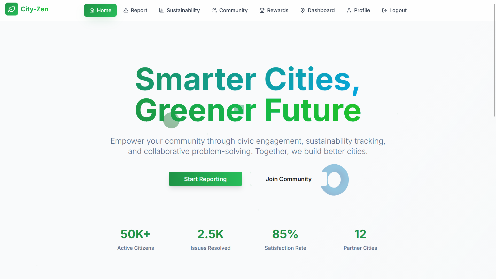
</td>
<td align="center">
<b>City Dashboard</b><br>
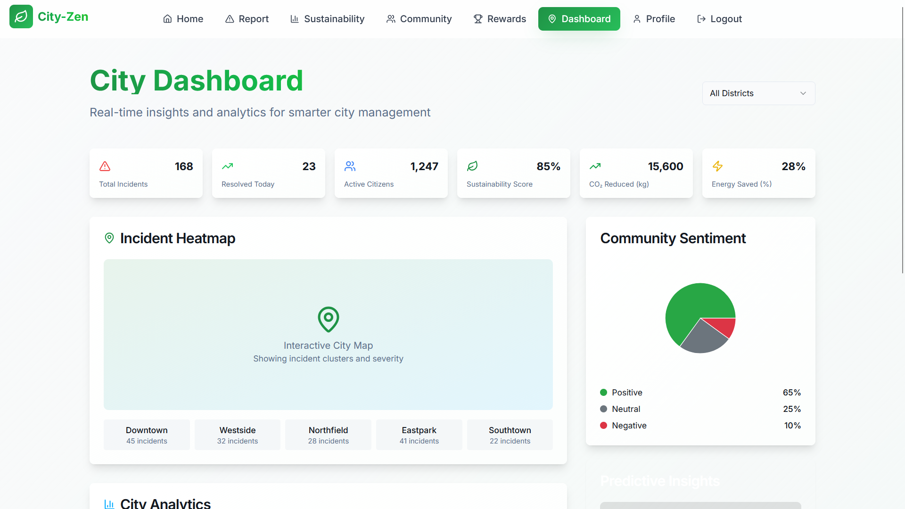
</td>
</tr>

<tr>
<td align="center">
<b>Report an Issue</b><br>
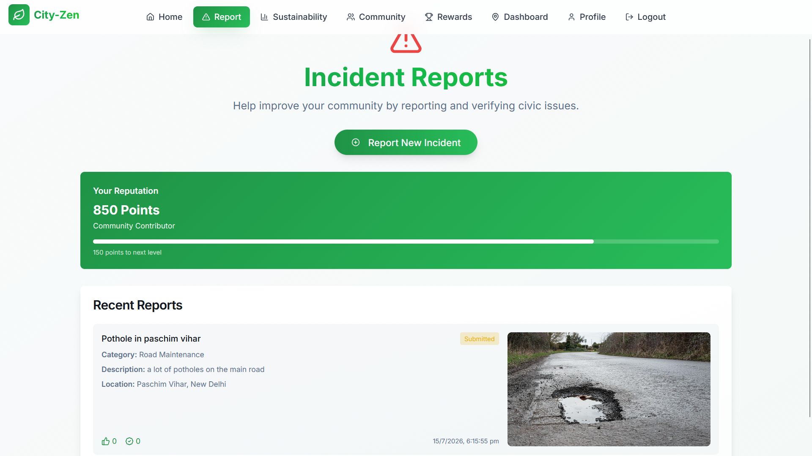
</td>
<td align="center">
<b>Community</b><br>
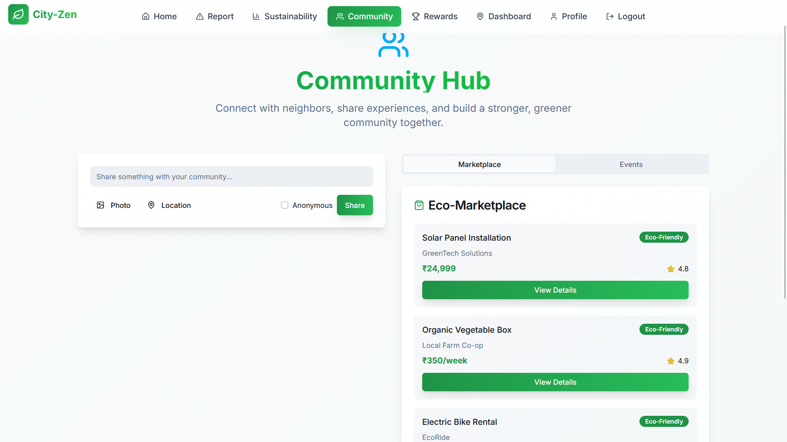
</td>
</tr>

<tr>
<td align="center">
<b>Sustainability</b><br>
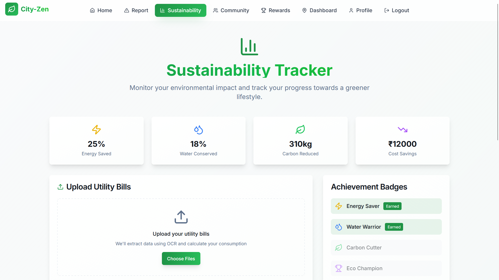
</td>
<td align="center">
<b>Rewards</b><br>
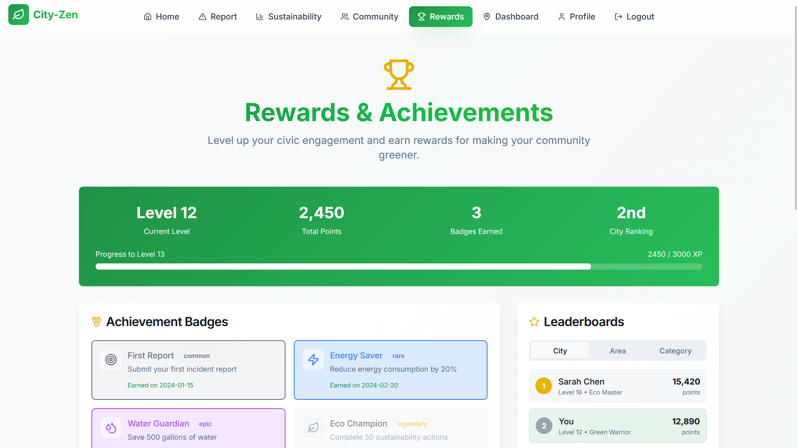
</td>
</tr>

<tr>
<td align="center">
<b>Leaderboard</b><br>
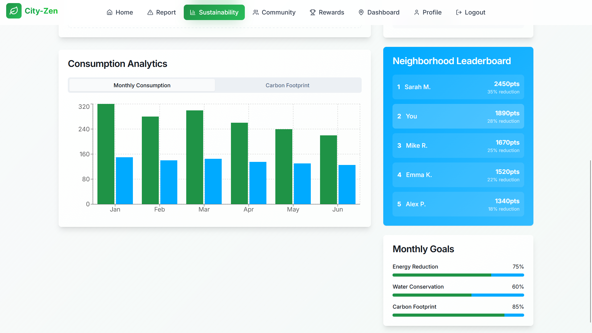
</td>
<td align="center">
<b>Analytics</b><br>
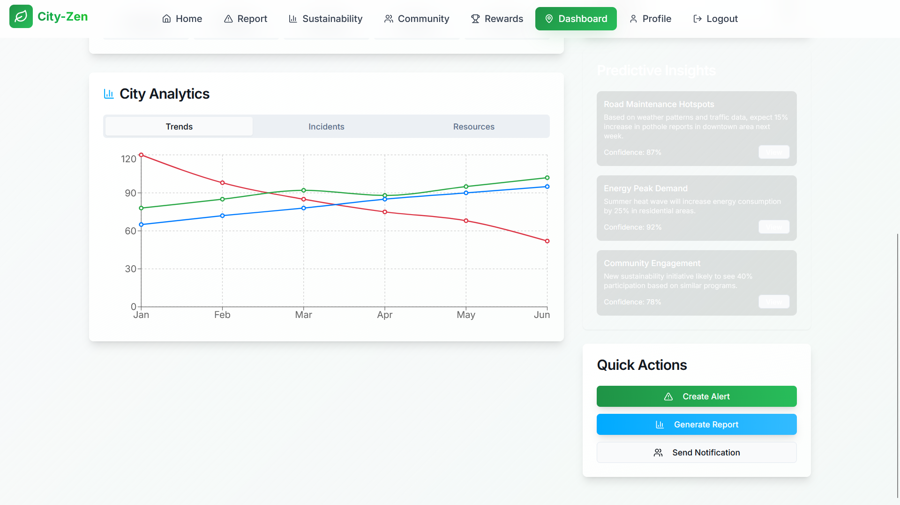
</td>
</tr>

<tr>
<td align="center">
<b>Profile</b><br>
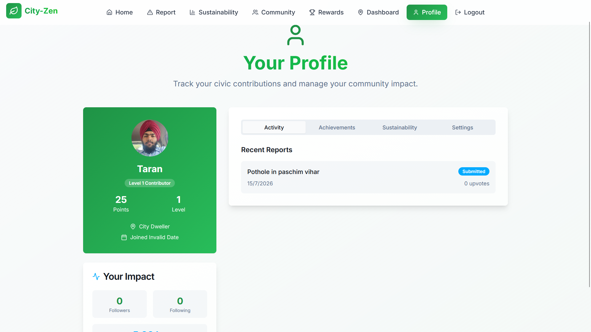
</td>
<td align="center">
<b>Features</b><br>
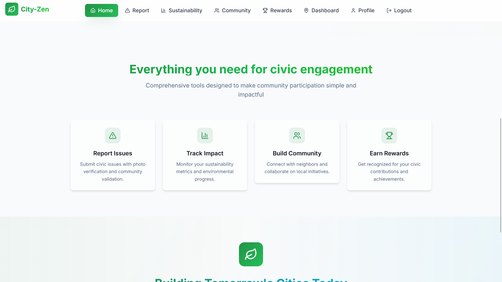
</td>
</tr>
</table>

### Loading Screen

<p align="center">
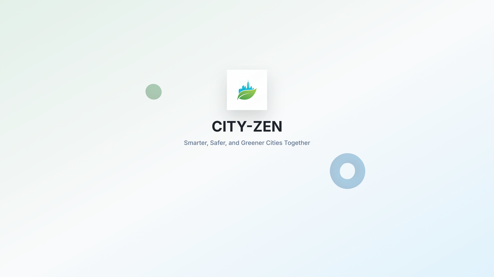
</p>

## 🤝 Contributing

Contributions are welcome! If you have ideas for new features, bug fixes, or improvements, please feel free to contribute.

1.  **Fork the repository.**
2.  **Create a new branch** (`git checkout -b feature/YourAmazingFeature`).
3.  **Make your changes.**
4.  **Commit your changes** (`git commit -m 'Add some AmazingFeature'`).
5.  **Push to the branch** (`git push origin feature/YourAmazingFeature`).
6.  **Open a Pull Request.**

---

## 📄 License

This project is licensed under the MIT License. See the [LICENSE](https://opensource.org/licenses/MIT) file for details.
